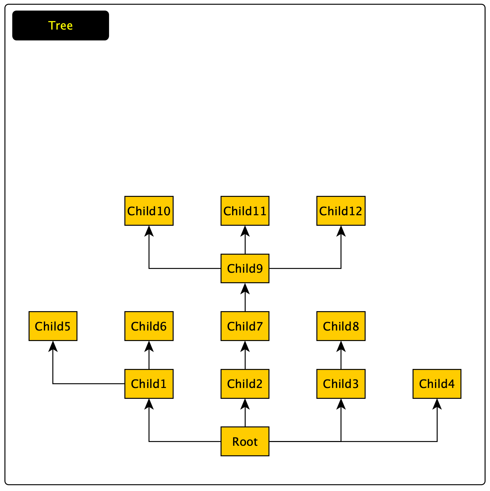

# TREE
Data Storage Tree

<hr>

This package allows you to create information **trees** based on **nodes**. An example of a tree is shown in the figure below.



<h2> 1. Tree </h2>

A tree is a structure based on nodes and has a root node. For a tree, there are a number of functions provided by Tree interface.

````go
type Tree interface {
	// Self - returns a pointer to a structure, for deeper data manipulation
	Self() *tree
	// Root - returns the root node
	Root() Node
	// SetRoot - Allows you to set the node as the root node. If the node is part of a tree, 
	// then the nodes are restructured to form a valid tree. If the node is not part of the tree, 
	// then the root node will be added to the childs, and the added node will become the root.
	SetRoot(node Node) error
	// FindByKey - searches for a key within a tree
	FindByKey(key string) Node
	// FindByValue - searches by field value within a tree 
	FindByValue(value interface{}) []Node
	// Separate - allows you to split a node from a tree into a new tree. All links are removed.
	Separate(node *node) (Tree, error)
	// JSON - marshaling to JSON
	JSON() ([]byte, error)
}
````

Note that the tree can also be obtained from a JSON file using the function LoadTree.

````go
	...
	t, _ := tree.LoadTree(name, path)
	...
````

<h2> 2. Nodes </h2>

**A node** is the main structural element of **a tree**. 

Each **node** has: 
* key - for a tree is a **unique identifier** that allows you to quickly find a node;
* fields - is a **map[string]interface{}**. Stores data by keys;
* pointer to tree - allows you to quickly access the tree;
* pointer to parent;
* pointers to children.

To create a node, use the function *NewNode*. The first argument is the key, the second is the fields. It is allowed to create a node without specifying a second argument, however, if an empty key is specified, it will return **nil**.
````go
	...
	node := tree.NewNode("key",nil)
	...
````

The main functions are presented in the Node interface:

````go
type Node interface {
	// Self - returns a pointer to a structure, for deeper data manipulation
	Self() *node
	// Tree - returns the tree.
	Tree() Tree
	// Root - returns root of the tree.
	Root() Node
	// Key - returns key of current node.
	Key() string
	// SetKey - sets the passed value as the key. Returns an error if the key already exists in the tree.
	SetKey(key string) error
	// Fields - return fields of current node. Fields is map[string]interface{}
	Fields() Fields
	// InheritedFields - allows you to get fields that are inherited from parent nodes.
	// If the field of the child node has the same key as the field of the parent node,
	// then the priority is given to the child node.
	InheritedFields() Fields
	// Parent - returns parent current node.
	Parent() Node
	// SetParent - sets the passed node as the parent node. 
	// The correctness of the tree is maintained by the appropriate reassignment of parent and child nodes
	SetParent(Node)
	// Childs - returns child nodes for current node.
	Childs() []Node
	// AddChilds - adding child nodes for the current node.
	// Child nodes are stripped of their current parent nodes.
	// The current node is set as the parent node.
	AddChilds(nodes ...Node) error
	// RemoveChild - deleting a child node for the current node
	RemoveChild(node Node)
	// FindingNodeByKey - search for a node in the tree relative to the current node
	FindingNodeByKey(key string) Node
}
````
<h1>  Tree</h1>


